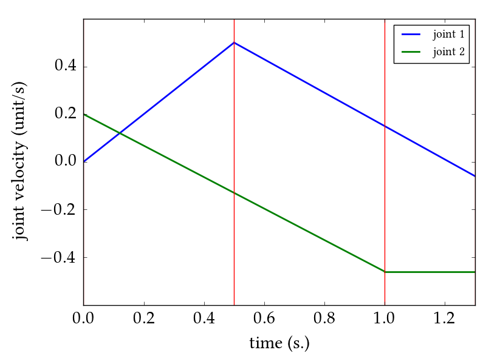
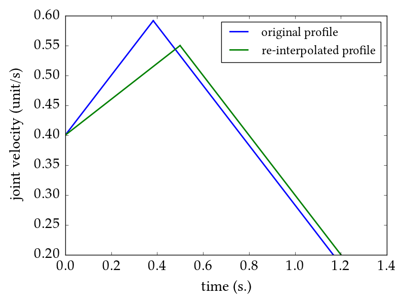

# Examples
## Parabint Trajectories

There are three types of trajectories:
 - `Ramp`: A 1D trajectory segment with constant acceleration. A Ramp is completely determined given four values: `v0` initial velocity, `a` acceleration, `t` duration, and `x0` initial displacement. The initial displacement is an optional argument which is set to `0` when not specified.
 - `ParabolicCurve`: A concatenation of `Ramp`s. A ParabolicCurve is then a 1D trajectory with a number of segments of constant accelerations.
 - `ParabolicCurvesND`: An n-dimensional trajectory consisting of n `ParabolicCurvesND`s of equal duration.
```python
from parabint.trajectory import Ramp, ParabolicCurve, ParabolicCurvesND

ramp1 = Ramp(0, 1, 0.5) # v0 = 0; a = 1; duration = 0.5; x0 = 0 (optional)
ramp2 = Ramp(ramp1.v1, -0.7, 0.8)
curve1 = ParabolicCurve(ramps=[ramp1, ramp2])

ramp3 = Ramp(0.2, -0.66, 1.0)
ramp4 = Ramp(ramp3.v1, 0, 0.3)
curve2 = ParabolicCurve(ramps=[ramp3, ramp4])
curvesnd = ParabolicCurvesND(curves=[curve1, curve2])

# curvesnd.PlotVel() # visualize the velocity profile
```
<p align="center">
  
</p>

The above figure shows the two velocity profiles in `curvesnd`. Vertical lines represent switch points, i.e., time instants where at least one joint changes its acceleration. When calling `PlotVel`, switch points can be plotted by setting the (optional) argument `includingSW` to `True`.

## Trajectory Interpolation

A parabolic trajectory can be generated from a set of boundary conditions `(x0, x1, v0, v1)` subject to max velocity `vm`, max acceleration `am`, and/or minimum-switch-time `delta`.
```python
from parabint import interpolator

x0 = 0; x1 = 0.5; v0 = 0.4; v1 = 0.2
vm = 1.0; am = 0.5
delta = 0.5

curve1 = interpolator.Compute1DTrajectory(x0, x1, v0, v1, vm, am) # without minimum-switch-time
curve2 = interpolator.Compute1DTrajectory(x0, x1, v0, v1, vm, am, delta) # with minimum-switch-time

# curve1.PlotVel(fignum=1)
# curve2.PlotVel(fignum=1)
```
<p align="center">
  
</p>
